> ⚠️ 아래 내용은 절대로 수정하지 않습니다.

# 멋쟁이사자처럼 10기 프론트엔드 과제 제출 가이드

아래에 나오는 내용 중 **이해할 수 없는 개념은 당장은 가뿐히 무시**합시다. Git과 Github은 나중에라도 충분히 친해질 수 있어요. 우리는 Github 환경에서 프론트엔드 과정의 **과제 제출 방법을 익히는데에만 집중**합니다.

(Git과 Github에 대한 두려움을 없애는 것은 덤 🥳)

## 1. 포크 (Fork)

지금 보고 계시는 `fe-assignments-submit-practice` 라는 저장소는 `Likelion-Inha-10` 라는 Github 조직(Organization) 에 소속된 저장소가 아니에요. Fork를 사용하면 지금 보고 있는 저장소를 내 계정으로 **복사** 할 수 있어요.

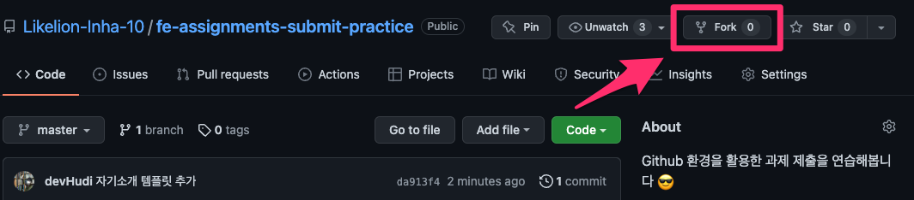

저장소 우측 상단에 위치한 Fork 버튼을 클릭해볼까요?

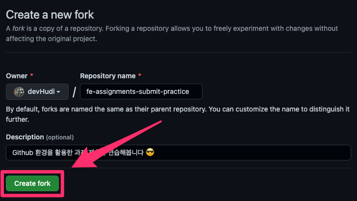

위와 같은 페이지로 이동되었다면, 바로 Create fork 를 클릭해주세요.

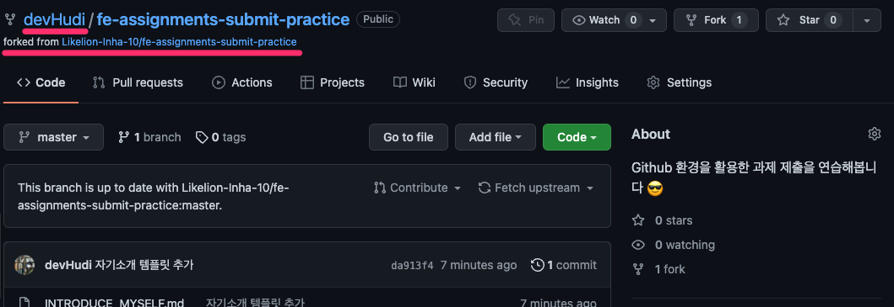

잠시 후 내 계정으로 복사된 저장소로 이동이 됩니다. 여기까지 도달하셨다면, Fork 는 성공입니다!

## 2. 클론 (Clone)

Fork 를 끝냈으면, Github 에 있는 내 저장소를 내 컴퓨터로 복사를 해봅시다. 이 과정을 Clone 이라고 해요. Gitkraken 을 켜볼까요?

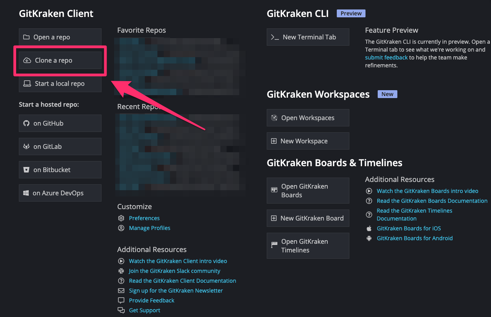

위 화면에서 Clone a repo 를 클릭합니다.

> 위 화면이 보이지 않을 경우 상단에 켜져있는 모든 탭을 닫아주세요.

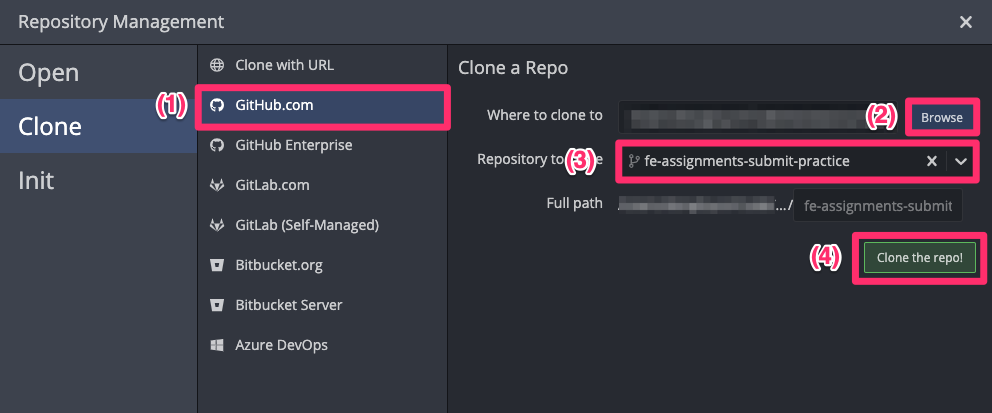

그림에 나타난 순서대로 클릭 및 설정 해주세요.

1. Github.com 선택
2. Browse 를 클릭하여 저장소를 Clone 할 경로(폴더) 선택
3. Clone 할 저장소 선택.
   우리가 Fork한 저장소의 이름을 입력해주세요. 여기서는 `fe-assignments-submit-practice` 겠죠? 😉
4. Clone the repo! 를 클릭하여 저장소를 Clone 합니다.

Clone 과정을 마치고 Browse 버튼으로 설정한 위치에 새로운 디렉토리가 생겼다면 성공입니다!

## 3. 과제 수행

자, 이제 저장소가 Clone 되어 우리 컴퓨터에 저장이 되었습니다. 이 디렉토리에서 여러분의 과제를 수행하고, 앞서 배운 Commit 을 통해 변경사항을 반영할 수 있어요.

이번 과제는 간단한 자기소개 작성입니다! 여러분이 보고 계신 문서와 같은 경로에 있는 `INTRODUCE_MYSELF.md` 파일을 열어 마크다운 문법으로 간단하게 여러분을 소개하는 글을 작성해주세요! (과제 제출 연습이니까 너무 공들이지는 맙시다 😇)

## 4. 푸쉬(Push)

파일을 수정하고, 커밋까지 완료하였다면 과제를 제출해야겠죠?

Push 는 내 컴퓨터 저장소(이하 로컬저장소)의 커밋된 변경이력을 내 Github 계정의 저장소(이하 원격저장소)에 업로드하는 과정정도로 이해해주시면 됩니다.

다시 Gitkraken 으로 돌아갈게요.

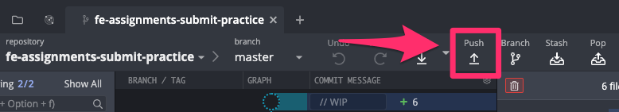

Gitkraken의 상단에 Push 라는 버튼을 클릭하면, 아마 최초 1번은 아래와 같은 오류가 발생할 거예요.

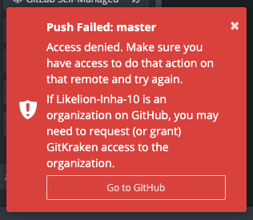

Go to GitHub을 클릭해주세요.

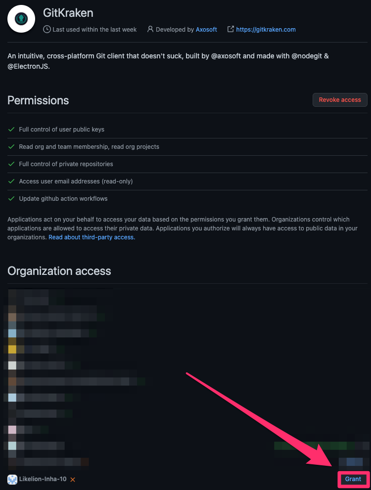

이동된 Github 화면에서 위 그림과 같이 `Likelion-Inha-10` 저장소 우측의 Grant 버튼을 클릭합니다.

## 5. 풀 리퀘스트(PR: Pull Request)

Pull Request 는 원격저장소의 변경된 내용을 우리가 Fork를 해온 `Likelion-Inha-10` 조직의 원본저장소(이하 원본저장소) 쪽으로 '저는 이렇게 내용을 수정했는데, 이 수정 내용을 원본저장소에 반영해주세요!' 라고 요청하는 과정이라고 이해해주시면 됩니다.

자신의 원격저장소에 들어가서 아래 그림에 나타난 순서대로 PR을 생성해봅시다.

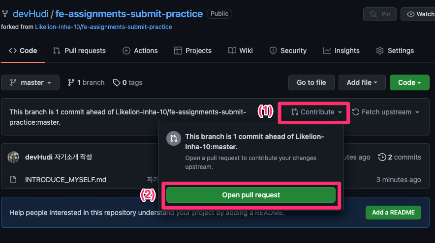

1. Contribute 클릭
2. Open pull request 클릭

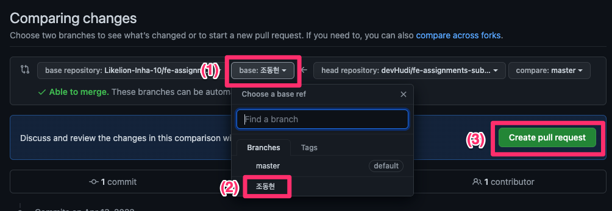

방금의 과정을 진행하면, 위와 같은 그림의 화면으로 이동될 것 입니다. 다시 사진과 같은 순서대로 클릭합니다.

1. base 를 클릭
2. 자신의 이름을 찾아 선택
3. Create pull request 클릭

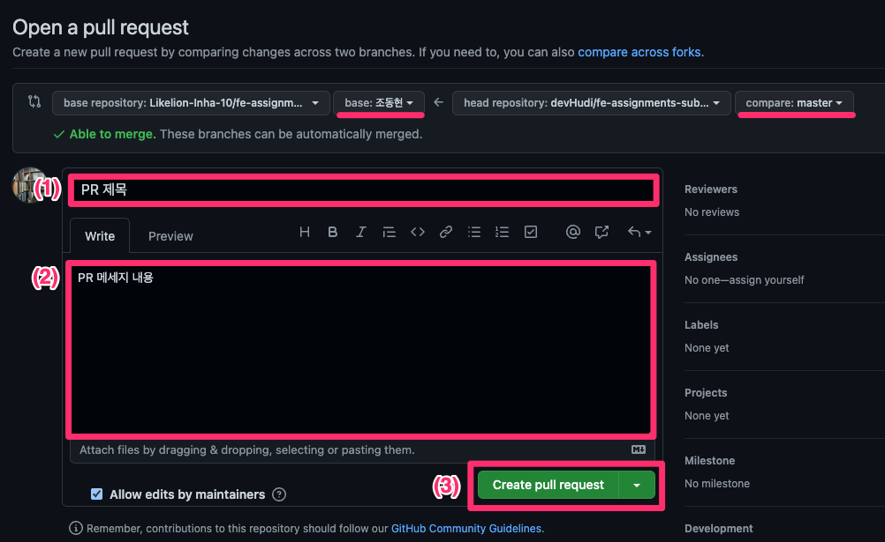

간단히 제목과 내용을 작성하고 Create pull request 버튼을 클릭하여 최종적으로 PR을 생성합니다.

> ⚠️ 반드시 상단 밑줄과 같이 base 브랜치가 자신의 이름으로, compare 브랜치가 master 인지 확인한 후 PR을 생성해주세요.

이 과정을 모두 진행했다면 과제 제출 성공입니다! 운영진이 해당 PR을 Merge 하면 해당 주차의 과제는 끝!
😎
